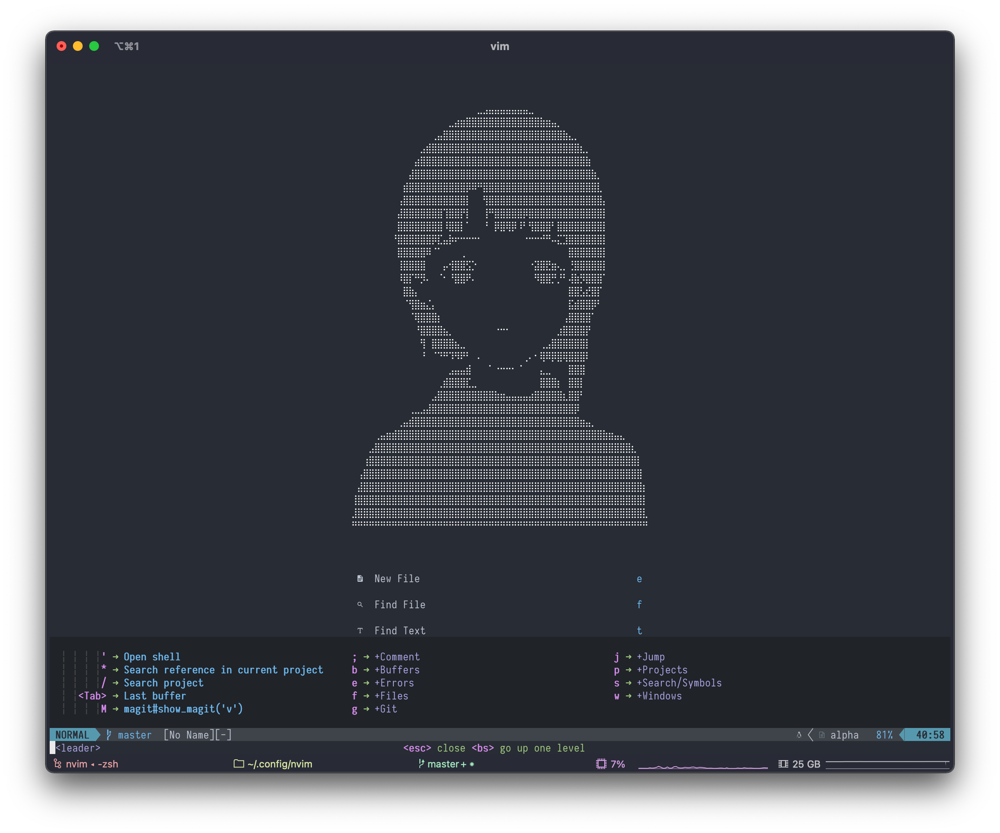
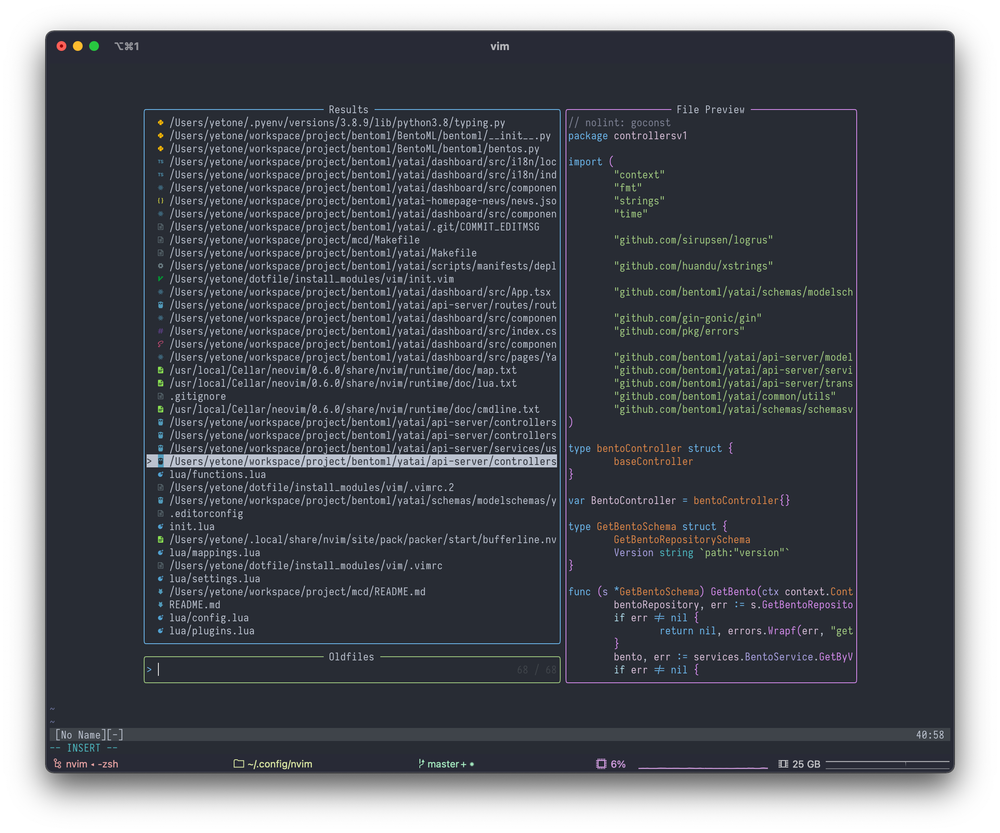
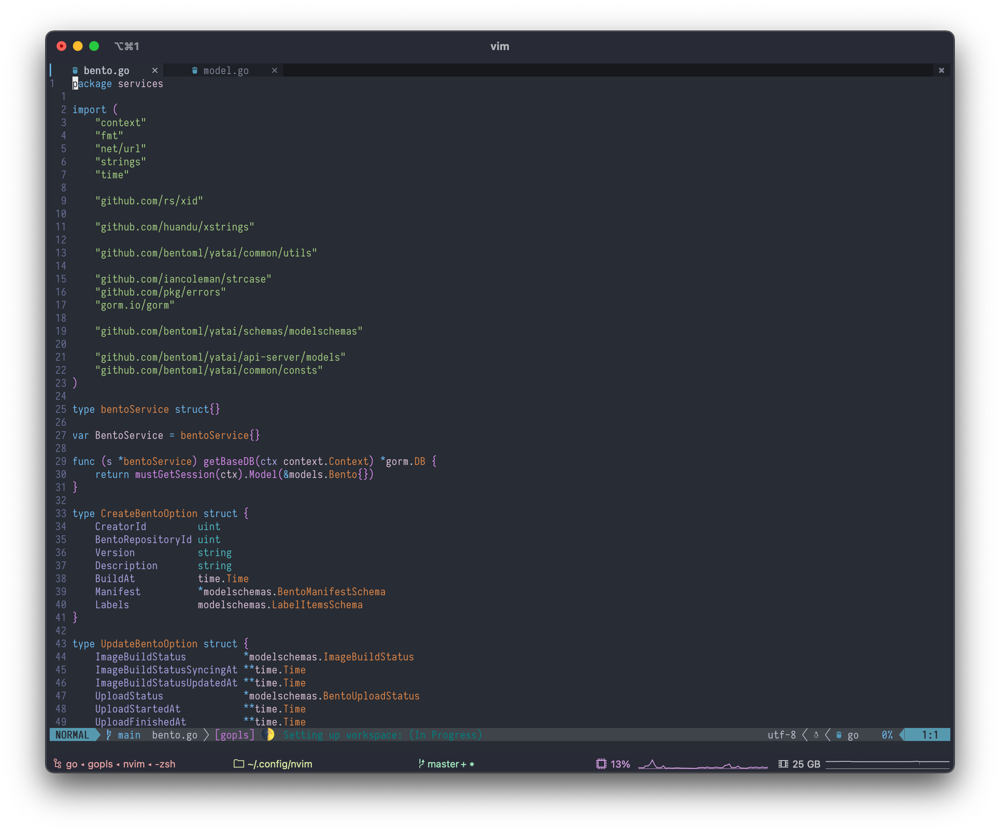
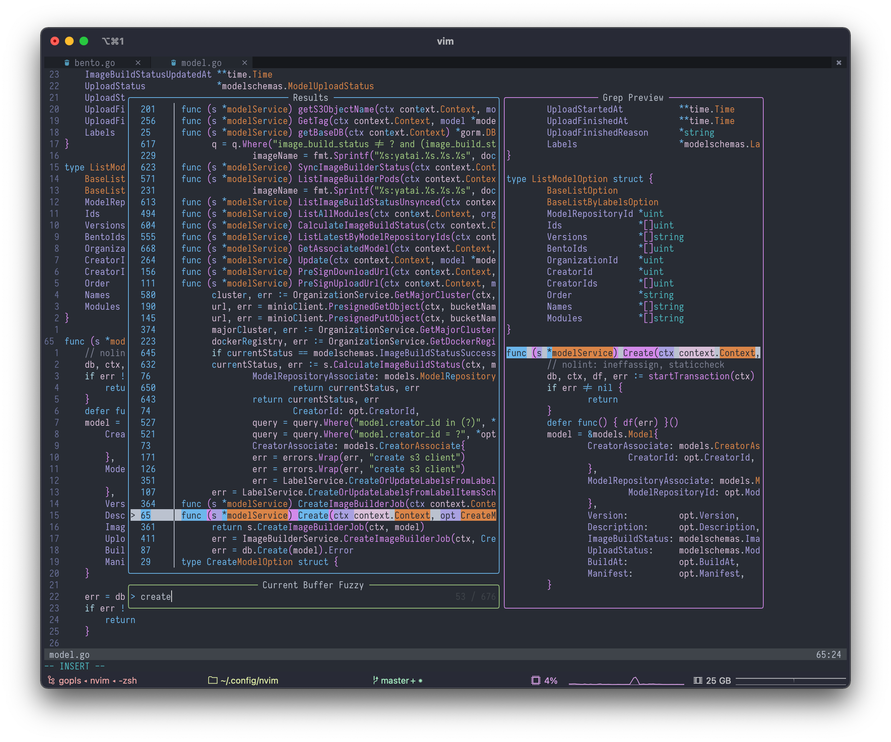
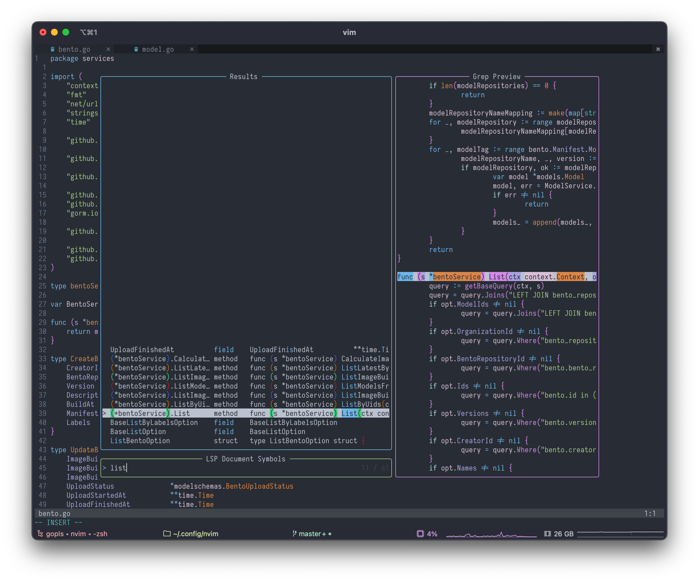

<h1 align="center">🪐 My NeoVim Configuration 🚀</h1>

<p align="center">
    
</p>

# Install

```bash
mv ~/.config/nvim{,.yetone-backup} || true

git clone https://github.com/yetone/nvim.git ~/.config/nvim

vim +PackerInstall
```

# Some screenshots

<p align="center">
    
</p>

<p align="center">
    
</p>

<p align="center">
    
</p>

<p align="center">
    
</p>
